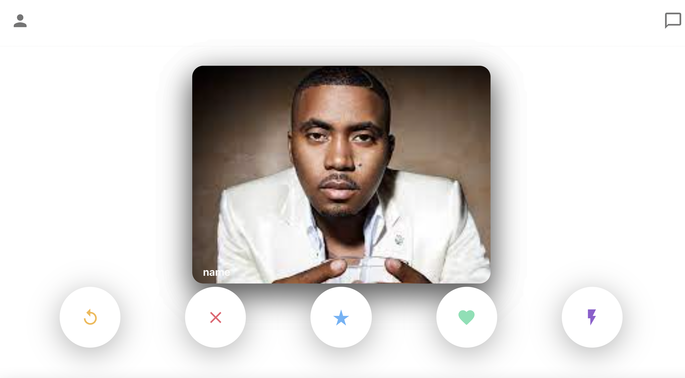
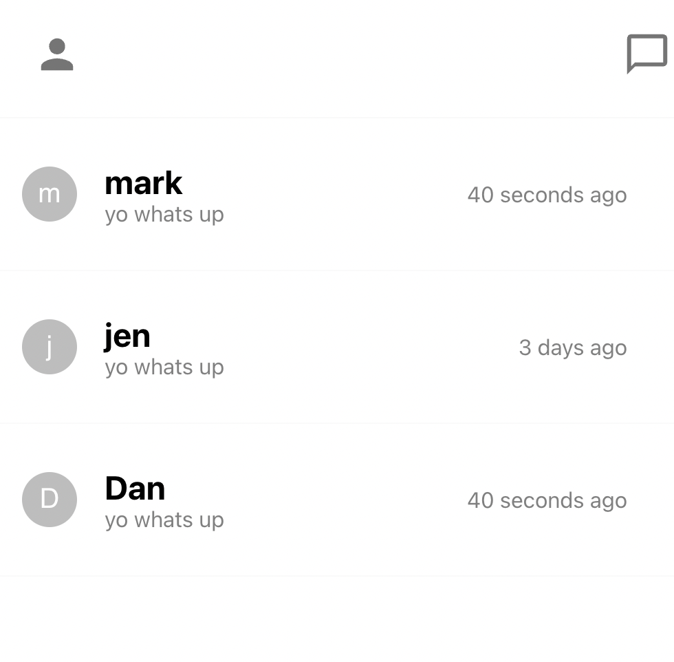
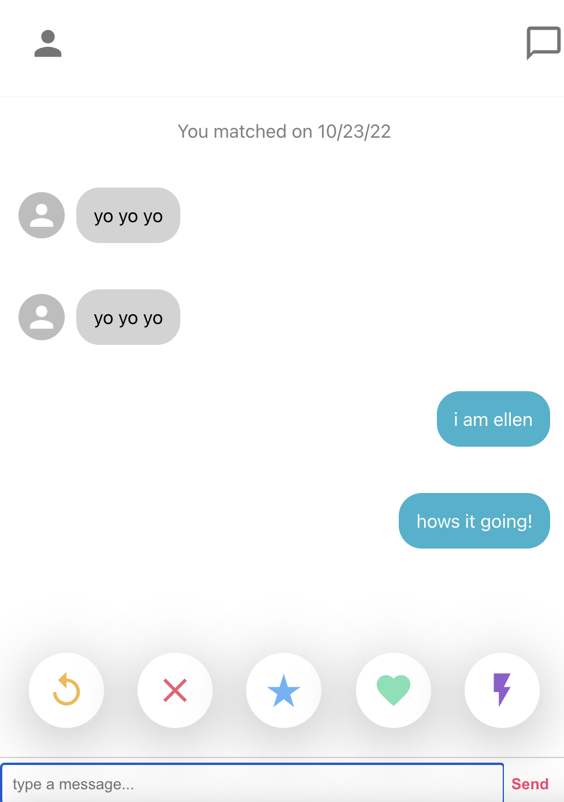

# tinder-clone :blue_heart:

  ### By bridgetvon * [Email me](bridget.schaefer31@gmail.com) * 

  ## Table of contents 📚
  * [Description](#Description)
  * [User Story](#User-story) 
  * [Installation Instructions](#installation-Instructions)
  * [Contributing](#Contributing)

  # Visual

 
 
 
 
  # Description
    A tinder clone made with react js, firestore database and hosted by firebase. 

  ## User Story :book:
  ```
  AS a developer
  I WANT to broaden my react skills by building a tinder clone
  SO THAT I can learn more and become a more proficient React developer.

  ```

  ## Installation Instructions :hammer_and_wrench:
  No installation, simply navigate to the deployed application

  ## Deployed 
  https://tinder-clone-1a5ac.web.app

  ## License :credit_card:
  * License Type: N/A


 ## Contributing 
 Bridget Schaefer 
    
 [Click to view my GitHub Profile!](https://github.com/bridgetvon) :skier:
